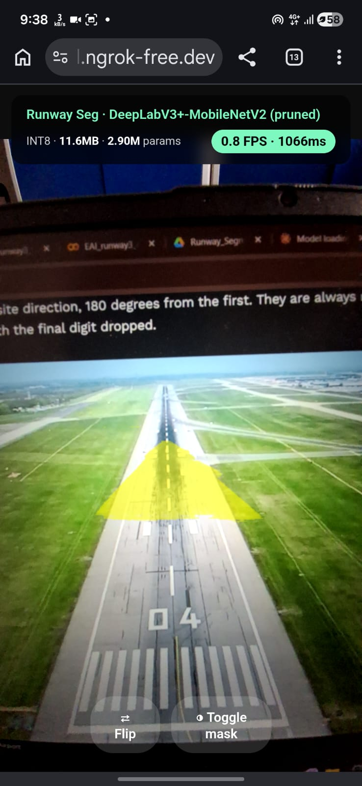
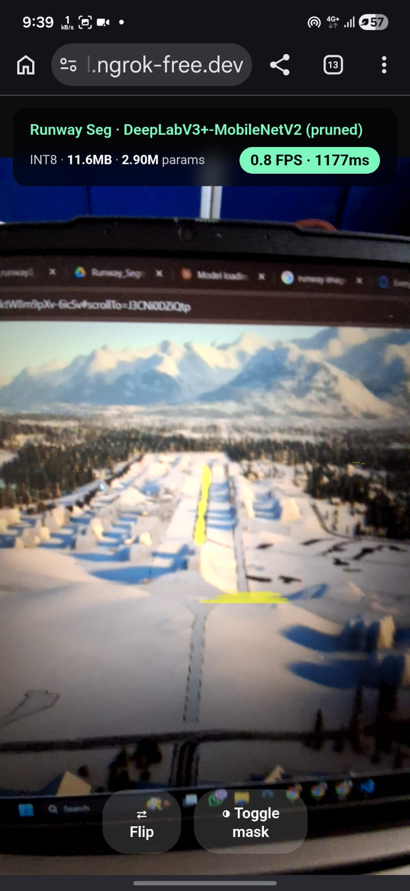
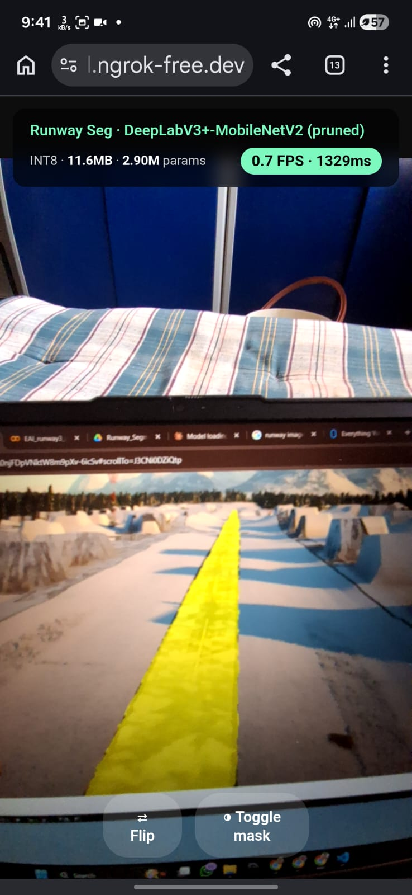

# Runway Segmentation — Embedded AI Project
### DeepLabV3+-MobileNetV2 | Pruned | ONNX | Browser Deployment

---

## Project Overview

This project develops a **lightweight, real-time runway segmentation system** using a compressed deep learning model deployable directly in a mobile web browser — no server GPU required.

The system identifies runway regions in aerial imagery using a **binary segmentation mask** (runway vs. background). The model is based on **DeepLabV3+ with a MobileNetV2 encoder**, trained on synthetic aerial runway images, then compressed via **structured channel pruning** (reducing size from 17.5 MB → 11.6 MB and parameters from 4.38M → 2.90M) with minimal accuracy loss (IoU drop < 0.5%).

The final model is exported to **ONNX format** and served through a single HTML file running **ONNX Runtime Web (WASM backend)** — live inference at ~0.8 FPS on a mid-range Android phone via browser, with a yellow mask overlay showing the detected runway.

---

## File / Folder Structure

```
runway-segmentation/
│
├── notebooks/
│   ├── EAI_ruway1.ipynb              # Phase 1 — Baseline training & evaluation
│   ├── EAI_runway2.ipynb             # Phase 2 — Pruning (structured + unstructured)
│   └── EAI_runway3_deploy_fixed.ipynb# Phase 3/5 — ONNX export & phone demo HTML
│
├── models/
│   ├── deeplabv3mobilenet_epoch28.pth        # Trained PyTorch baseline checkpoint
│   ├── runway_seg_pruned.onnx                # Pruned ONNX model (with .data sidecar)
│   ├── runway_seg_pruned_onnx.data           # External weight sidecar (not browser-compatible)
│   └── runway_seg_pruned_simplified.onnx    # Self-contained simplified ONNX (browser-ready)
│
├── results/
│   ├── phase2_results.json           # Pruning metrics (IoU, Dice, size, GPU ms)
│   ├── phase2_table.csv              # Tabular comparison of all pruning variants
│   ├── phase2_pruning_analysis.png   # Pruning analysis charts
│   └── phase5_onnx_predictions.png  # Sample ONNX segmentation output visualisation
│
├── demo/
│   └── runway_seg_demo.html          # Self-contained browser demo (serve locally or via ngrok)
│
└── README.md                         # This file
```

---

## Dependencies & Libraries

### Python (for training notebooks — run in Google Colab)

| Library | Version | Purpose |
|---|---|---|
| `torch` | ≥ 2.0 | Model training, pruning |
| `torchvision` | ≥ 0.15 | DeepLabV3+ model builder |
| `torch-pruning` | latest | Structured channel pruning (TP) |
| `onnx` | ≥ 1.14 | ONNX model export |
| `onnxruntime` | ≥ 1.17 | CPU ONNX inference verification |
| `onnxsim` | ≥ 0.4 | ONNX graph simplification |
| `numpy` | ≥ 1.24 | Array operations |
| `matplotlib` | ≥ 3.7 | Visualisation & result plots |
| `pandas` | ≥ 2.0 | Tabular result export |
| `Pillow` | ≥ 10.0 | Image loading |
| `tqdm` | any | Progress bars |

Install all at once (Colab):
```bash
pip install torch torchvision torch-pruning onnx onnxruntime onnxsim numpy matplotlib pandas Pillow tqdm
```

### Browser Demo (no install needed)
| Library | How loaded |
|---|---|
| `onnxruntime-web@1.21.0` | CDN via jsDelivr (auto-loaded in HTML) |

---

## Demo screenshots 
Since real-world aerial access to runways was unavailable during testing, we validated the application using a "hardware-in-the-loop" approach. We displayed high-resolution aerial runway imagery on a laptop screen and captured the live segmentation output using the mobile application.





## Steps to Run

### Run demo Directly 
**Run demo directly (no build required)**
  1. `demo` file already have all the required files. `runway_seg_demo.html` and `runway_seg_pruned_simplified.onnx` are together in the same folder (the `demo/` folder already contains these files).
  2. Serve the `demo/` folder locally from the command line:
     ```powershell
     cd demo
     python -m http.server 8080
     ```
     Open `http://localhost:8080/runway_seg_demo.html` in Chrome or another modern browser.
  3. To run on a mobile device from your computer, expose the local server with ngrok (or similar):
     ```powershell
     ngrok http 8080
     ```
     Open the provided ngrok HTTPS URL on your phone browser.
  4. In the demo page press **Start Camera** and grant camera permission. Point the camera at a runway image or printed test image.
  5. Expected behaviour: live yellow mask overlay showing detected runway (mobile performance ≈ 0.6–1.0 FPS depending on device).

**Notes for mobile/browser**
- The demo uses ONNX Runtime Web (WASM backend). For best performance use Chrome or a Chromium-based browser on Android.
- If you need slightly faster inference and can host with proper headers, enable cross-origin isolation and the multi-threaded WASM backend (not available on plain ngrok HTTP).
- If camera access fails on mobile, open the ngrok URL over HTTPS (ngrok default) and ensure camera permissions are granted for that origin.


## If you are interested in reproducing the work follow the following steps

### Step 1 — Train Baseline Model (`EAI_ruway1.ipynb`)
1. Open in Google Colab.
2. Mount Google Drive (`drive.mount`).
3. Set dataset path in **CELL 3 Config** to your aerial runway image dataset.
4. Run all cells sequentially.
5. Output: `deeplabv3mobilenet_epoch28.pth` saved to Drive.
6. **Expected output:** Baseline IoU ≈ 0.797, Dice ≈ 0.861 printed in CELL 8.

### Step 2 — Pruning Analysis (`EAI_runway2.ipynb`)
1. Open in Google Colab.
2. Set checkpoint path in **CELL 3** to the `.pth` file from Step 1.
3. Run all cells — notebook runs both unstructured (20%–70% sparsity) and structured (20% ratio) pruning automatically.
4. **Expected outputs:**
   - `pruned_struct_20pct.pth` — pruned model checkpoint
   - `phase2_results.json` — metrics table
   - `phase2_pruning_analysis.png` — 3-panel chart
   - `phase2_table.csv` — CSV comparison

### Step 3 — ONNX Export & Demo (`EAI_runway3_deploy_fixed.ipynb`)
1. Open in Google Colab.
2. Set pruned checkpoint path in **CELL 3**.
3. Run all cells in order:
   - CELL 6: Exports runway_seg_pruned.onnx
   - CELL 7: Simplifies graph → runway_seg_pruned_simplified.onnx (self-contained)
   - CELL 8: Verifies ONNX output matches PyTorch
   - CELL 9: CPU benchmark (expected ≈ 400–800 ms on Colab CPU)
   - CELL 10: Saves `phase5_onnx_predictions.png`
   - CELL 11: Generates `runway_seg_demo.html`
4. **Expected output:** Segmentation predictions visualised; HTML demo file generated.

 
---

## Expected Outputs for Verification

| Phase | Expected Result |
|---|---|
| Baseline training (28 epochs) | IoU = 0.797, Dice = 0.861 |
| Structured pruning (20%) | IoU = 0.802, size = 11.6 MB, params = 2.90M |
| ONNX export verification | Max output difference vs PyTorch < 1e-4 |
| CPU ONNX benchmark | ~400–800 ms/inference (Colab CPU) |
| Browser demo (mobile) | ~0.7–0.8 FPS, ~1100 ms/frame, yellow mask on runway |

---

## Notes
- The browser demo **only works with `runway_seg_pruned_simplified.onnx`** (self-contained). The split `.onnx + .data` version requires server-side loading.
- ONNX Runtime Web uses single-threaded WASM by default (multi-threading requires `crossOriginIsolated` headers not available on free ngrok).
- Model input: `[1, 3, 512, 512]` float32, ImageNet-normalised. Output: `[1, 1, 512, 512]` logits.


## Phase 2 results table (CSV)

The full pruning comparison table is included as a CSV in the repository. View or download it here: [results/phase2_table.csv](results/phase2_table.csv).
